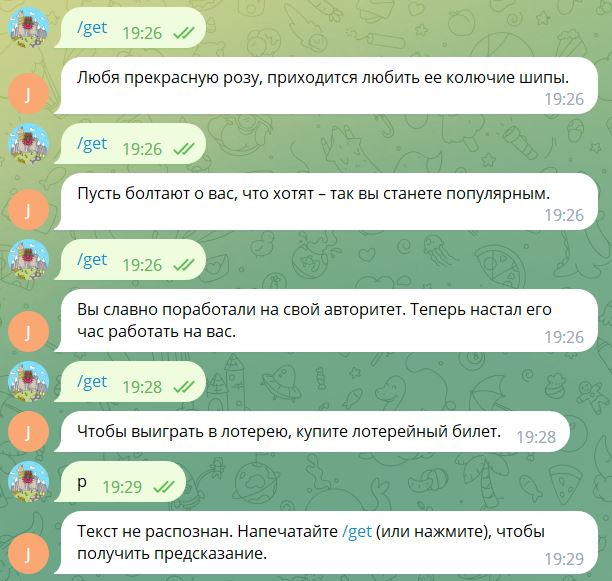

<h1 style="border:2px solid MediumSeaGreen;">

Chat bot message generator

</h1>

<h2>

The bot that writes random predictions with lovely advice

</h2>

> ***With this super simple bot for Telegram you can easily create 
> your own prediction generator like here in this example or maybe
> you need fact generator (it can be facts about your product or some 
> thematic facts, etc.). The use cases for a bot can be completely 
> different, whether for work (facts about your product or service) 
> or just for fun.***

Here's an example of the bot in action:

> *Just write some text in csv file (or add new file with different format) 
> to customize this bot according 
> to your own needs*.
>
> 

> <b><i>One string = one message</i></b>
> 

***Don't forget to generate your bot and its token from BotFather
in Telegram***
